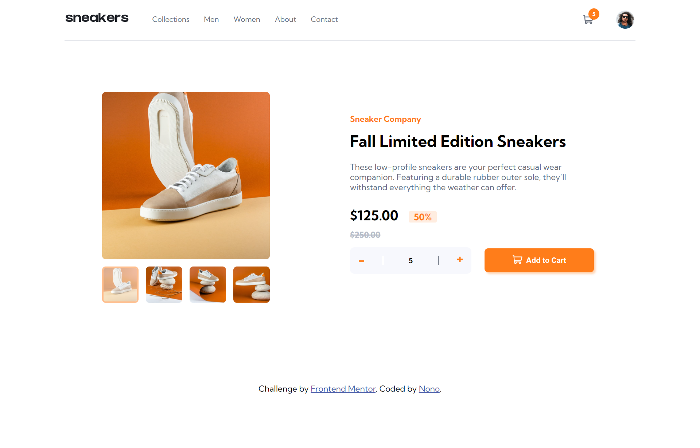

 # Frontend Mentor - E-commerce product page solution

This is a solution to the [E-commerce product page challenge on Frontend Mentor](https://www.frontendmentor.io/challenges/ecommerce-product-page-UPsZ9MJp6). Frontend Mentor challenges help you improve your coding skills by building realistic projects.

## Table of contents

- [Overview](#overview)
  - [The challenge](#the-challenge)
  - [Screenshot](#screenshot)
  - [Links](#links)
- [My process](#my-process)
  - [Built with](#built-with)
  - [What I learned](#what-i-learned)
  - [Useful resources](#useful-resources)
- [Author](#author)

## Overview

### The challenge

Users should be able to:

- View the optimal layout for the site depending on their device's screen size
- See hover states for all interactive elements on the page
- Open a lightbox gallery by clicking on the large product image
- Switch the large product image by clicking on the small thumbnail images
- Add items to the cart
- View the cart and remove items from it

### Screenshot

### Links

- Solution URL: [SOLUTION URL](https://your-solution-url.com)
- Live Site URL: [LIVE URL here](https://4002-nonye.github.io/Ecommerce-product-page-main/)

## My process

### Built with

- Semantic HTML5 markup
- CSS custom properties
- Flexbox
- CSS Grid
- Mobile-first workflow
- [jQuery](https://jquery.com/) - JS library

**Note: These are just examples. Delete this note and replace the list above with your own choices**

### What I learned
I learnt how to build different components like slider and lightbox.
I learnt how to use jQuery, esprcially loops!!! I love jquery.

### Useful resources

- [jQuery docs](https://api.jquery.com/) - This helped me understand how to use loops in jQuery, it's way easier than i thought.

## Author

- Github - [Nono](https://github.com/4002-Nonye)
- Twitter - [@the_altekid](https://twitter.com/the_altekid)
- Frontend Mentor - [@4002-Nonye](https://www.frontendmentor.io/profile/4002-Nonye)
